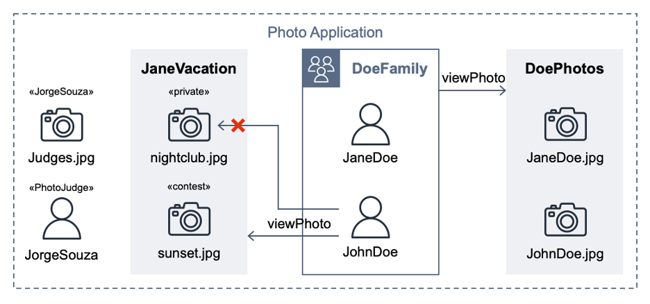

# Fine-Grained Authorization in Modern Software Applications

This repository contains the [presentation](./Fine-Grained%20Authorization%20in%20Modern%20Software%20Applications.pdf) and supporting code samples.  For best results, clone and open in Visual Studio Code and install the recommend extensions found in `.vscode\extensions.json`.

> Authentication (AuthN) and Authorization (AuthZ) are critical for most software applications. The increased adoption of standardized frameworks for AuthN has improved overall security posture. “Broken Authentication” was #2 risk on the OWASP Top 10:2017 list but slid in 2021 to be part of a rescoped #7. AuthZ is trending the wrong direction with “Broken Access Control” the #1 security risk on 2021 list. This session discusses how open-source policy languages and evaluation engines can improve access control in applications.
>
> The key acronyms are reviewed for background: JWT concepts (claims, scopes); access control models (RBAC, ABAC, ReBAC), data-flow model of XACML (PAP, PDP, PEP, PIP). Examples of applications requiring fine-grained authorization are modeled using different open-source solutions (Cedar, OpenFGA, OPA) focusing on their policy language and evaluation engine integration. This session spans high-level architecture to low-level code, and sprinkles humor (and acronyms) throughout.

This repository reuses the hypothetical photo sharing application model from the [Cedar policy language in action](https://catalog.workshops.aws/cedar-policy-language-in-action) workshop. By using that app, users organize their photos into albums and share them with groups of users. Figure 1 shows the entities from the photo application.


Figure 1: Photo Application entities

Below are the instructions to use the different tools (CLI, playgrounds, tests) from various open source authorization projects.

## Cedar

> Cedar is a language for writing authorization policies and making authorization decisions based on those policies.  Using Cedar, you can decouple your business logic from the authorization logic.

- [Cedar docs](https://docs.cedarpolicy.com/)
- [Cedar Playground](https://www.cedarpolicy.com/en/playground)
- [Cedar CLI](https://crates.io/crates/cedar-policy-cli)

Files in the `cedar` folder:

- `*.cedar` Cedar policies
- `cedarschema` declaration of the structure of the entity types
- `cedarentities.json` entity data
- `cedar.test.ts` test suite
- `testdata\**` supporting data for policy tests

### Run TypeScript tests

`npx vitest` to run the suite of tests
Running `npx vitest` finds and runs `cedar.test.ts` which loads policies from `testdata/temppolicies.cedar`, entity data from `cedarentities.json` and calls isAuthorized on some `testdata/**/*.cedarauth.json` files.

### Cedar CLI validate and authorize

`validate` the policies and schema

```bash
cedar validate -f plain --policies testdata/temppolicies.cedar --schema cedarschema  --schema-format human
```

```text
policy set validation passed
    Diagnostic severity: advice
    Caused by: no errors or warnings
```

`authorize` a request

```bash
cedar authorize -v -f plain \
  --policies testdata/temppolicies.cedar \
  --entities cedarentities.json \
  --request-json "testdata/Role PhotoJudge/ALLOW/JorgeSouza-view-sunset-session.cedarauth.json"
```

```text
ALLOW

note: this decision was due to the following policies:
  PhotoJudge
```

## Open Policy Agent (OPA)

> The Open Policy Agent is an open source, general-purpose policy engine that unifies policy enforcement across the stack. OPA provides a high-level declarative language that lets you specify policy as code and simple APIs to offload policy decision-making from your software.

- [Open Policy Agent docs](https://www.openpolicyagent.org/docs/latest/)
- [The Rego Playground](https://play.openpolicyagent.org/)
- [OPA CLI](https://www.openpolicyagent.org/docs/latest/cli/)

Files in the `opa` folder:

- `photoapp.rego` application rules
- `photoapp_test.rego` application tests
- `data.json` entity data
- `input/*.regoinput.json` inputs for CLI `eval` calls
- `schemas/data-schema` JSON schema for data.json
- `schemas/regoinput-schema.json` JSON schema for input/*.regoinput.json
- `opa.test.js` test suite

### Run a single evaluation

Note: `--schema schemas/` will used schemas directory for metadata schema["xxx"] references in `photoapp.rego` model.

```bash
opa eval "data.photoapp.is_authorized" \
  --schema schemas/ \
  --format pretty \
  --data photoapp.rego \
  --data data.json \
  --input input/JaneDoe-view-JohnDoe.regoinput.json
```

```json
{
  "decision": "ALLOW",
  "determiningPolicies": [
    "DoePhotos"
  ]
}
```

### Run the test cases

The `photoapp_test.rego` contains test rules (in verbose mode) using embedded input data.

```bash
opa test data.json photoapp.rego photoapp_test.rego -v
```

```text
photoapp_test.rego:
data.photoapptest.Album_DoePhotos.test_JaneDoe_viewPhoto_JohnDoe: PASS (8.335056ms)
data.photoapptest.Album_DoePhotos.test_JohnDoe_viewPhoto_JaneDoe: PASS (685.629µs)
data.photoapptest.Role_PhotoJudge.test_JorgeSouza_viewPhoto_sunset_session: PASS (872.898µs)
data.photoapptest.Role_PhotoJudge.test_JorgeSouza_viewPhoto_sunset_nosession: PASS (1.075985ms)
data.photoapptest.User_JorgeSouza.test_JorgeSouza_viewPhoto_Judges: PASS (546.614µs)
--------------------------------------------------------------------------------
PASS: 5/5
```

### Build OPA WASM

Running `npm run build` will compile `photoapp.rego` into an executable WASM module.

```bash
opa build -t wasm -e photoapp/is_authorized ./photoapp.rego && tar xzf bundle.tar.gz /policy.wasm
```

Running `npx vitest` finds and runs `opa.test.js` which uses `loadPolicy` from `@open-policy-agent/opa-wasm`, then loads `data.json` and calls evaluate on some `input/*.regoinput.json` files.

```text
 ✓ opa.test.js (2)
   ✓ photoapp test suite (2)
     ✓ JaneDoe-view-JohnDoe
     ✓ JorgeSouza-view-sunset

 Test Files  1 passed (1)
      Tests  2 passed (2)
```

### Run the rego playground

1. visit https://play.openpolicyagent.org/
1. paste `photoapp.rego` into left pane
1. paste one of the `input\*.regoinput.json` into INPUT
1. paste `data.json` into DATA
1. click **Evaluate** button (or select "is_authorized" from left and click **Evaluate Selection** button)

## OpenFGA

> [OpenFGA](https://openfga.dev/) is an open-source authorization solution that allows developers to build granular access control using an easy-to-read modeling language and friendly APIs.

- [OpenFGA CLI](https://github.com/openfga/cli/)
- Playground embedded in openfga server (http://localhost:3000/playground)

Files in the `openfga` folder:

- `model.fga` application schema
- `tuples.yaml` application relationship data
- `store.fga.yaml` references to model_file and tuple_file; adds tests

### Validate the model

Use the OpenFGA CLI to validate the model:

```bash
fga model validate --file model.fga
```

```json
{
  "is_valid":true
}
```

### Run tests

Use the OpenFGA CLI to run tests:

> If a model is provided, the test will run in a built-in OpenFGA instance (you do not need a separate server).

```bash
fga model test --tests store.fga.yaml
```

```text
# Test Summary #
Tests 12/12 passing
Checks 25/25 passing
```

### Run the openfga playground

Using docker (or [finch](https://github.com/runfinch/finch)) to run the openfga server.  First `docker pull openfga/openfga` then:

```bash
docker run -p 8080:8080 -p 8081:8081 -p 3000:3000 openfga/openfga run
```

Load the model and tuples into the server

```bash
export FGA_STORE_ID=$(fga store create --model model.fga --name "PhotoApp" | jq -r .store.id)
fga tuple write --store-id=$FGA_STORE_ID --file tuples.yaml 
```

In the [localhost playground](http://localhost:3000/playground), try these tuple queries:

- who is related to UserGroup:DoeFamily as member?
- who is related to Album:DoePhotos as viewPhoto?
- who is related to Album:JaneVacation as viewPhoto?
